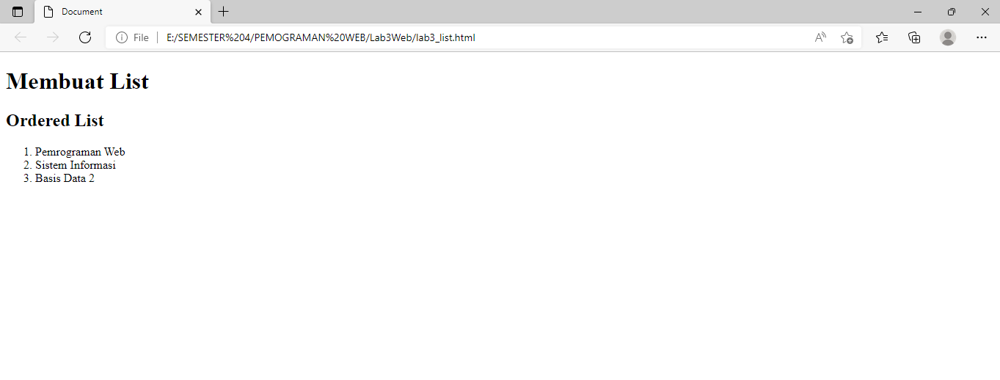

# Lab3Web
Tugas pertemuan 4 Pemograman Web

Saya akan membuat tugas pertemuan 4 Lab3Web

Nama : Abdul Rahman

NIM : 312010061

Kelas : TI.20.B.1

1. Membuat dokumen HTML

2. Membuat ordered list

3. Membuat unordered list

4. Membuat Description List

